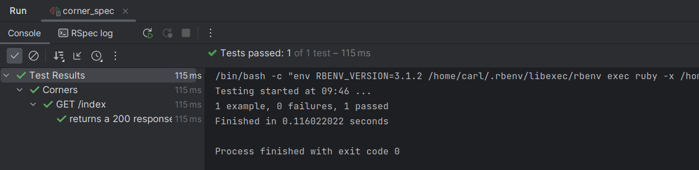

# Dokumentation

## Trennung Präsentations- und Anwendungslogik

Eine Trennung von Präsentations- und Anwendungslogik wird oft in der Softwareentwicklung angewendet, um den Code übersichtlicher, wartbarer und wiederverwendbarer zu machen.

1. Modulare Struktur: Durch die Trennung von Präsentations- und Anwendungslogik wird der Code in verschiedene Module aufgeteilt. Dadurch wird der Code besser strukturiert und leichter zu verstehen, zu warten und zu erweitern.
   
2. Wiederverwendbarkeit: Die Trennung ermöglicht die Wiederverwendung der Anwendungslogik in verschiedenen Präsentationsschichten. Die Anwendungslogik kann unabhängig von der Präsentationsschicht entwickelt und in verschiedenen Benutzeroberflächen wiederverwendet werden, z. B. in einer Webanwendung und einer mobilen App.

4. Testbarkeit: Durch die Trennung wird die Testbarkeit verbessert. Die Anwendungslogik kann isoliert von der Präsentationsschicht getestet werden, indem automatisierte Tests geschrieben werden, die sich auf die Funktionalität und Geschäftslogik konzentrieren. Dadurch können Fehler leichter erkannt und behoben werden.

5. Flexibilität: Durch die Trennung ist es einfacher, verschiedene Präsentationsschichten zu verwenden oder zu ändern, ohne die Anwendungslogik zu beeinflussen. Beispielsweise kann die Benutzeroberfläche einer Webanwendung geändert werden, ohne dass Änderungen an der zugrunde liegenden Anwendungslogik erforderlich sind.


Nachteile einer Trennung von Präsentations- und Anwendungslogik:

1. Komplexität: Die Trennung kann die Komplexität des Codes erhöhen, insbesondere wenn die Kommunikation zwischen der Präsentations- und Anwendungslogik aufwendig ist. Die Verwaltung der Interaktion und der Datenübertragung zwischen den Schichten erfordert eine sorgfältige Planung und Implementierung.

2. Mehraufwand: Die Trennung erfordert zusätzlichen Aufwand bei der Entwicklung, da die Logik in zwei getrennten Schichten implementiert werden muss. Dies kann dazu führen, dass die Entwicklung insgesamt mehr Zeit und Ressourcen erfordert.

3. Koordination: Eine klare Koordination zwischen der Präsentations- und Anwendungslogik ist erforderlich, um sicherzustellen, dass die beiden Schichten effektiv zusammenarbeiten. Eine schlechte Koordination kann zu Ineffizienzen und Inkonsistenzen führen.

4. Overhead: Bei einer strikten Trennung können zusätzliche Schritte erforderlich sein, um Daten zwischen den Schichten zu übertragen, was zu einem gewissen Overhead führen kann. Dies kann die Leistung beeinträchtigen, insbesondere in ressourcenintensiven Anwendungen.

## Anwendung des MVC Patterns

Ich habe die schon entwickelte Frontend-Applikation in eine Rails-Applikation eingebaut. In dieser Rails-Applikation habe ich das "GUI" erweitert und eine Datenstruktur aufgebaut.

Die Applikation entspricht dem MVC pattern.

## Synchronisation zwischen Views

Ich weiss nicht was damit gemeint ist.

## Ereignisverarbeitung

Ereignisverarbeitung mache ich hauptsächlich on page mit Javascript und Systemweit wird ein Ereignis über den controller weitergeleitet durch das besuchen verschiedener Routen in der Applikation.

## Testing

Für das Testing meiner Applikation ist das anwenden eines Unit-Tests das sinnvollste. Da die Applikation eine Webapplikation ist kann ich mit Request-Tests testen ob die Seiten und somit die GUI die ich anzeige korrekt gerendert wird.

In anbetracht auf die begrenzte Zeit die wir haben, habe ich nur 1 Unit-Test ausgeführt, aber das Prinizip von Testing ist trotzdem vorhanden.

### Protokoll

#### Corner Factory

```ruby
FactoryBot.define do
  factory :corner do
    name { "ocean" }
    velocity { 20.0 }
  end
end

```

#### Request spec

```ruby
RSpec.describe "Corners", type: :request do
  describe "GET /index" do
    let(:corner) { create(:corner) }

    it 'returns a 200 response' do
      get corner_path(corner)
      expect(response).to have_http_status(200)
    end
  end
end

```
### Test Result


